---

## 📄 **GENERACIÓN DE ARCHIVOS .DAT - LIBRO IVA DIGITAL**

### **🎯 Resumen Ejecutivo - Archivos .DAT**

Los archivos .DAT son la herramienta fundamental para la carga masiva de información contable en el **Portal IVA - Libro IVA Digital** de ARCA. Los sistemas contables generan **4 archivos mensuales** específicos que contienen todos los datos de comprobantes de compras y ventas, permitiendo cumplir con las obligaciones fiscales de manera automatizada.

### **📊 Estructura de Archivos .DAT Requeridos**

#### **📁 Los 4 Archivos Mensuales Obligatorios**

| Archivo | Descripción | Contenido | Formato |
|---------|-------------|-----------|---------|
| **1. VENTAS_CBTE.dat** | Cabecera de Ventas | Datos principales de facturas emitidas | 266 caracteres por línea |
| **2. VENTAS_ALICUOTAS.dat** | Alícuotas de Ventas | Detalle de IVA por comprobante de venta | 62 caracteres por línea |
| **3. COMPRAS_CBTE.dat** | Cabecera de Compras | Datos principales de facturas recibidas | 325 caracteres por línea |
| **4. COMPRAS_ALICUOTAS.dat** | Alícuotas de Compras | Detalle de IVA por comprobante de compra | 84 caracteres por línea |

### **📋 Especificaciones Técnicas Detalladas**

#### **🧾 ARCHIVO 1: VENTAS_CBTE.dat (Cabecera de Ventas)**
```
Longitud: 266 caracteres por registro
Codificación: ANSI
Estructura de campos (posición desde-hasta):
```

| Campo | Pos. | Long. | Tipo | Descripción | Formato |
|-------|------|-------|------|-------------|---------|
| 1 | 1-8 | 8 | N | Fecha comprobante | AAAAMMDD |
| 2 | 9-11 | 3 | N | Tipo de comprobante | Ver tabla códigos |
| 3 | 12-16 | 5 | N | Punto de venta | Numérico |
| 4 | 17-36 | 20 | N | Número de comprobante | Con ceros a izquierda |
| 5 | 37-56 | 20 | N | Número hasta (rangos) | Con ceros a izquierda |
| 6 | 57-58 | 2 | N | Código documento comprador | Ver tabla documentos |
| 7 | 59-78 | 20 | AN | CUIT/DNI comprador | Con ceros a izquierda |
| 8 | 79-108 | 30 | AN | Razón social comprador | Texto |
| 9 | 109-123 | 15 | N | Importe total operación | 13 enteros + 2 decimales |
| 10 | 124-138 | 15 | N | Conceptos no gravados | 13 enteros + 2 decimales |
| 11 | 139-153 | 15 | N | Percepción no categorizados | 13 enteros + 2 decimales |
| 12 | 154-168 | 15 | N | Operaciones exentas | 13 enteros + 2 decimales |
| 13 | 169-183 | 15 | N | Percepciones nacionales | 13 enteros + 2 decimales |
| 14 | 184-198 | 15 | N | Percepciones IIBB | 13 enteros + 2 decimales |
| 15 | 199-213 | 15 | N | Percepciones municipales | 13 enteros + 2 decimales |
| 16 | 214-228 | 15 | N | Impuestos internos | 13 enteros + 2 decimales |
| 17 | 229-231 | 3 | AN | Código moneda | Ver tabla monedas |
| 18 | 232-241 | 10 | N | Tipo de cambio | 4 enteros + 6 decimales |
| 19 | 242-242 | 1 | N | Cantidad alícuotas IVA | Numérico |
| 20 | 243-243 | 1 | A | Código operación | Ver tabla códigos |
| 21 | 244-258 | 15 | N | Otros tributos | 13 enteros + 2 decimales |
| 22 | 259-266 | 8 | N | Fecha vencimiento | AAAAMMDD |

#### **🧾 ARCHIVO 2: VENTAS_ALICUOTAS.dat (Detalle IVA Ventas)**
```
Longitud: 62 caracteres por registro
Codificación: ANSI
```

| Campo | Pos. | Long. | Tipo | Descripción | Formato |
|-------|------|-------|------|-------------|---------|
| 1 | 1-3 | 3 | N | Tipo comprobante | Debe coincidir con cabecera |
| 2 | 4-8 | 5 | N | Punto de venta | Debe coincidir con cabecera |
| 3 | 9-28 | 20 | N | Número comprobante | Debe coincidir con cabecera |
| 4 | 29-43 | 15 | N | Importe neto gravado | 13 enteros + 2 decimales |
| 5 | 44-47 | 4 | N | Alícuota IVA | Ver tabla alícuotas |
| 6 | 48-62 | 15 | N | Impuesto liquidado | 13 enteros + 2 decimales |

#### **🧾 ARCHIVO 3: COMPRAS_CBTE.dat (Cabecera de Compras)**
```
Longitud: 325 caracteres por registro
Codificación: ANSI
```

| Campo | Pos. | Long. | Tipo | Descripción | Formato |
|-------|------|-------|------|-------------|---------|
| 1 | 1-8 | 8 | N | Fecha comprobante | AAAAMMDD |
| 2 | 9-11 | 3 | N | Tipo comprobante | Ver tabla compras |
| 3 | 12-16 | 5 | N | Punto de venta | Numérico |
| 4 | 17-36 | 20 | N | Número comprobante | Con ceros a izquierda |
| 5 | 37-52 | 16 | AN | Despacho importación | Solo para importaciones |
| 6 | 53-54 | 2 | N | Código documento vendedor | Ver tabla documentos |
| 7 | 55-74 | 20 | AN | CUIT vendedor | Con ceros a izquierda |
| 8 | 75-104 | 30 | AN | Razón social vendedor | Texto |
| 9 | 105-119 | 15 | N | Importe total operación | 13 enteros + 2 decimales |
| 10 | 120-134 | 15 | N | Conceptos no gravados | 13 enteros + 2 decimales |
| 11 | 135-149 | 15 | N | Operaciones exentas | 13 enteros + 2 decimales |
| 12 | 150-164 | 15 | N | Percepciones IVA | 13 enteros + 2 decimales |
| 13 | 165-179 | 15 | N | Percepciones nacionales | 13 enteros + 2 decimales |
| 14 | 180-194 | 15 | N | Percepciones IIBB | 13 enteros + 2 decimales |
| 15 | 195-209 | 15 | N | Percepciones municipales | 13 enteros + 2 decimales |
| 16 | 210-224 | 15 | N | Impuestos internos | 13 enteros + 2 decimales |
| 17 | 225-227 | 3 | AN | Código moneda | Ver tabla monedas |
| 18 | 228-237 | 10 | N | Tipo de cambio | 4 enteros + 6 decimales |
| 19 | 238-238 | 1 | N | Cantidad alícuotas IVA | Numérico |
| 20 | 239-239 | 1 | A | Código operación | Ver tabla códigos |
| 21 | 240-254 | 15 | N | Crédito fiscal computable | 13 enteros + 2 decimales |
| 22 | 255-269 | 15 | N | Otros tributos | 13 enteros + 2 decimales |
| 23 | 270-280 | 11 | N | CUIT emisor/corredor | Para intermediarios |
| 24 | 281-310 | 30 | AN | Denominación corredor | Nombre del intermediario |
| 25 | 311-325 | 15 | N | IVA comisión | 13 enteros + 2 decimales |

#### **🧾 ARCHIVO 4: COMPRAS_ALICUOTAS.dat (Detalle IVA Compras)**
```
Longitud: 84 caracteres por registro
Codificación: ANSI
```

| Campo | Pos. | Long. | Tipo | Descripción | Formato |
|-------|------|-------|------|-------------|---------|
| 1 | 1-3 | 3 | N | Tipo comprobante | Debe coincidir con cabecera |
| 2 | 4-8 | 5 | N | Punto de venta | Debe coincidir con cabecera |
| 3 | 9-28 | 20 | N | Número comprobante | Debe coincidir con cabecera |
| 4 | 29-30 | 2 | N | Código documento vendedor | Ver tabla documentos |
| 5 | 31-50 | 20 | AN | CUIT vendedor | Con ceros a izquierda |
| 6 | 51-65 | 15 | N | Importe neto gravado | 13 enteros + 2 decimales |
| 7 | 66-69 | 4 | N | Alícuota IVA | Ver tabla alícuotas |
| 8 | 70-84 | 15 | N | Impuesto liquidado | 13 enteros + 2 decimales |

### **📚 Tablas de Referencia Críticas**

#### **🏷️ Códigos de Tipo de Comprobante (Principales)**
```javascript
const TIPOS_COMPROBANTE = {
  "001": "FACTURAS A",
  "002": "NOTAS DE DEBITO A", 
  "003": "NOTAS DE CREDITO A",
  "006": "FACTURAS B",
  "007": "NOTAS DE DEBITO B",
  "008": "NOTAS DE CREDITO B", 
  "011": "FACTURAS C",
  "012": "NOTAS DE DEBITO C",
  "013": "NOTAS DE CREDITO C",
  "019": "FACTURAS DE EXPORTACION",
  "033": "LIQUIDACION PRIMARIA DE GRANOS",
  "051": "FACTURAS M",
  "081": "TIQUE FACTURA A",
  "082": "TIQUE FACTURA B",
  "331": "LIQUIDACION SECUNDARIA DE GRANOS"
};
```

#### **💰 Códigos de Alícuotas IVA**
```javascript
const ALICUOTAS_IVA = {
  "0003": "0,00%",
  "0004": "10,50%", 
  "0005": "21,00%",
  "0006": "27,00%",
  "0008": "5,00%",
  "0009": "2,50%"
};
```

#### **📄 Códigos de Tipos de Documento**
```javascript
const TIPOS_DOCUMENTO = {
  "80": "CUIT",
  "86": "CUIL", 
  "87": "CDI",
  "96": "DNI",
  "99": "SIN IDENTIFICAR / VENTA GLOBAL DIARIA"
};
```

#### **🔤 Códigos de Operación**
```javascript
const CODIGOS_OPERACION = {
  "A": "No Alcanzado",
  " ": "No corresponde", // Espacio en blanco
  "0": "No corresponde", // Cero
  "C": "Operación Canje",
  "E": "Operaciones Exentas", 
  "N": "No gravado",
  "X": "Exportación al Exterior",
  "Z": "Exportación a Zona Franca"
};
```

### **💻 Implementación Técnica para Claude Code**

#### **🔧 Generador de Archivos .DAT**
```typescript
interface ComprobanteCabecera {
  fecha: Date;
  tipoComprobante: string;
  puntoVenta: number;
  numeroComprobante: number;
  tipoDocumento: string;
  numeroDocumento: string;
  razonSocial: string;
  importeTotal: number;
  // ... otros campos
}

interface ComprobanteAlicuota {
  tipoComprobante: string;
  puntoVenta: number;
  numeroComprobante: number;
  importeNeto: number;
  alicuotaIVA: string;
  impuestoLiquidado: number;
}

class GeneradorDATLibroIVA {
  
  /**
   * Genera los 4 archivos .DAT para un período mensual
   */
  async generarArchivosDAT(
    ventasCabecera: ComprobanteCabecera[],
    ventasAlicuotas: ComprobanteAlicuota[],
    comprasCabecera: ComprobanteCabecera[],
    comprasAlicuotas: ComprobanteAlicuota[],
    periodo: string
  ): Promise<ArchivosDATResult> {
    
    return {
      ventasCbte: this.generarVentasCabecera(ventasCabecera),
      ventasAlicuotas: this.generarVentasAlicuotas(ventasAlicuotas),
      comprasCbte: this.generarComprasCabecera(comprasCabecera),
      comprasAlicuotas: this.generarComprasAlicuotas(comprasAlicuotas)
    };
  }

  private generarVentasCabecera(comprobantes: ComprobanteCabecera[]): string {
    return comprobantes.map(comp => {
      let linea = '';
      
      // Campo 1: Fecha (posiciones 1-8)
      linea += this.formatearFecha(comp.fecha, 8);
      
      // Campo 2: Tipo comprobante (posiciones 9-11)
      linea += this.padLeft(comp.tipoComprobante, 3, '0');
      
      // Campo 3: Punto de venta (posiciones 12-16)
      linea += this.padLeft(comp.puntoVenta.toString(), 5, '0');
      
      // Campo 4: Número comprobante (posiciones 17-36)
      linea += this.padLeft(comp.numeroComprobante.toString(), 20, '0');
      
      // Campo 5: Número hasta (posiciones 37-56)
      linea += this.padLeft(comp.numeroComprobante.toString(), 20, '0');
      
      // Campo 6: Código documento (posiciones 57-58)
      linea += this.padLeft(comp.tipoDocumento, 2, '0');
      
      // Campo 7: Número identificación (posiciones 59-78)
      linea += this.padLeft(comp.numeroDocumento, 20, '0');
      
      // Campo 8: Razón social (posiciones 79-108)
      linea += this.padRight(comp.razonSocial, 30, ' ');
      
      // Campo 9: Importe total (posiciones 109-123)
      linea += this.formatearImporte(comp.importeTotal, 15);
      
      // ... continuar con todos los campos hasta posición 266
      
      return linea;
    }).join('\n');
  }

  private generarVentasAlicuotas(alicuotas: ComprobanteAlicuota[]): string {
    return alicuotas.map(ali => {
      let linea = '';
      
      // Campo 1: Tipo comprobante (posiciones 1-3)
      linea += this.padLeft(ali.tipoComprobante, 3, '0');
      
      // Campo 2: Punto de venta (posiciones 4-8)
      linea += this.padLeft(ali.puntoVenta.toString(), 5, '0');
      
      // Campo 3: Número comprobante (posiciones 9-28)
      linea += this.padLeft(ali.numeroComprobante.toString(), 20, '0');
      
      // Campo 4: Importe neto gravado (posiciones 29-43)
      linea += this.formatearImporte(ali.importeNeto, 15);
      
      // Campo 5: Alícuota IVA (posiciones 44-47)
      linea += this.padLeft(ali.alicuotaIVA, 4, '0');
      
      // Campo 6: Impuesto liquidado (posiciones 48-62)
      linea += this.formatearImporte(ali.impuestoLiquidado, 15);
      
      return linea;
    }).join('\n');
  }

  private generarComprasCabecera(comprobantes: ComprobanteCabecera[]): string {
    // Implementación similar a ventas pero con 325 caracteres
    // Incluye campos específicos como CUIT emisor/corredor, IVA comisión, etc.
  }

  private generarComprasAlicuotas(alicuotas: ComprobanteAlicuota[]): string {
    // Implementación similar a ventas pero con 84 caracteres
    // Incluye código documento vendedor y CUIT vendedor
  }

  /**
   * Utilitarios para formateo
   */
  private formatearFecha(fecha: Date, longitud: number): string {
    const year = fecha.getFullYear().toString();
    const month = (fecha.getMonth() + 1).toString().padStart(2, '0');
    const day = fecha.getDate().toString().padStart(2, '0');
    return `${year}${month}${day}`.padStart(longitud, '0');
  }

  private formatearImporte(importe: number, longitud: number): string {
    // Formato: 13 enteros + 2 decimales sin punto decimal
    const importeStr = Math.round(importe * 100).toString();
    return this.padLeft(importeStr, longitud, '0');
  }

  private padLeft(str: string, length: number, char: string): string {
    return str.padStart(length, char);
  }

  private padRight(str: string, length: number, char: string): string {
    return str.padEnd(length, char).substring(0, length);
  }
}
```

#### **📤 Exportador Integrado**
```typescript
class ExportadorLibroIVA {
  
  async exportarMesPeriodo(
    cuit: string,
    year: number,
    month: number
  ): Promise<ZipArchivo> {
    
    // 1. Obtener comprobantes del período
    const comprobantes = await this.obtenerComprobantesPeriodo(cuit, year, month);
    
    // 2. Procesar y clasificar
    const clasificados = this.clasificarComprobantes(comprobantes);
    
    // 3. Generar archivos .DAT
    const generador = new GeneradorDATLibroIVA();
    const archivos = await generador.generarArchivosDAT(
      clasificados.ventasCabecera,
      clasificados.ventasAlicuotas,
      clasificados.comprasCabecera,
      clasificados.comprasAlicuotas,
      `${year}${month.toString().padStart(2, '0')}`
    );
    
    // 4. Crear ZIP con codificación ANSI
    const zip = new JSZip();
    
    // Convertir a ANSI (importante para ARCA)
    zip.file(`LIBRO_IVA_DIGITAL_VENTAS_CBTE_${year}${month}.dat`, 
      this.convertirAANSI(archivos.ventasCbte));
    
    zip.file(`LIBRO_IVA_DIGITAL_VENTAS_ALICUOTAS_${year}${month}.dat`, 
      this.convertirAANSI(archivos.ventasAlicuotas));
      
    zip.file(`LIBRO_IVA_DIGITAL_COMPRAS_CBTE_${year}${month}.dat`, 
      this.convertirAANSI(archivos.comprasCbte));
      
    zip.file(`LIBRO_IVA_DIGITAL_COMPRAS_ALICUOTAS_${year}${month}.dat`, 
      this.convertirAANSI(archivos.comprasAlicuotas));
    
    return await zip.generateAsync({type: 'blob'});
  }

  /**
   * Validaciones críticas antes de generar
   */
  private validarDatos(comprobantes: any[]): ValidationResult {
    const errores = [];
    
    comprobantes.forEach((comp, index) => {
      // Validar fechas
      if (!this.validarFecha(comp.fecha)) {
        errores.push(`Línea ${index}: Fecha inválida`);
      }
      
      // Validar CUIT/DNI
      if (!this.validarDocumento(comp.numeroDocumento, comp.tipoDocumento)) {
        errores.push(`Línea ${index}: Documento inválido`);
      }
      
      // Validar importes
      if (comp.importeTotal < 0) {
        errores.push(`Línea ${index}: Importe no puede ser negativo`);
      }
      
      // Validar correspondencia cabecera-alícuotas
      if (!this.validarCorrespondencia(comp)) {
        errores.push(`Línea ${index}: No coinciden cabecera y alícuotas`);
      }
    });
    
    return { valido: errores.length === 0, errores };
  }

  private convertirAANSI(texto: string): ArrayBuffer {
    // Convertir UTF-8 a ANSI/Windows-1252
    const encoder = new TextEncoder();
    return encoder.encode(texto);
  }
}
```

### **📋 Validaciones y Controles Críticos**

#### **✅ Validaciones Obligatorias**
```typescript
const VALIDACIONES_CRITICAS = {
  // Formato de archivo
  codificacion: 'ANSI', // ¡CRÍTICO! UTF-8 genera errores
  extension: '.dat',
  separador_linea: '\n', // Sin \r\n
  
  // Longitudes exactas
  ventas_cabecera: 266, // caracteres exactos
  ventas_alicuotas: 62,
  compras_cabecera: 325,
  compras_alicuotas: 84,
  
  // Correspondencia de registros
  orden_sincronizado: true, // CABECERA y ALÍCUOTAS mismo orden
  referencia_cruzada: true, // Tipo+PV+Número debe coincidir
  
  // Límites de archivo
  tamaño_maximo_txt: '70MB',
  tamaño_maximo_zip: '10MB',
  
  // Datos obligatorios
  cuit_valido: /^\d{11}$/,
  fecha_formato: 'AAAAMMDD',
  importes_sin_decimales: true // Multiplicar por 100
};
```

#### **🚨 Errores Comunes y Soluciones**
```typescript
const ERRORES_FRECUENTES = {
  "Error longitud registro línea X": {
    causa: "Longitud de línea incorrecta",
    solucion: "Verificar que cada campo tenga exactamente la longitud especificada"
  },
  
  "Error codificación archivo": {
    causa: "Archivo en UTF-8 en lugar de ANSI",
    solucion: "Convertir a codificación ANSI/Windows-1252"
  },
  
  "No coinciden cabecera y alícuotas": {
    causa: "Orden diferente entre archivos de cabecera y alícuotas",
    solucion: "Mantener el mismo orden en ambos archivos"
  },
  
  "CUIT inválido": {
    causa: "CUIT con formato incorrecto",
    solucion: "CUIT debe ser exactamente 11 dígitos con ceros a la izquierda"
  },
  
  "Fecha inválida": {
    causa: "Formato de fecha incorrecto",
    solucion: "Usar formato AAAAMMDD sin separadores"
  }
};
```

### **🔄 Flujo de Trabajo Completo**

#### **📊 Pipeline de Generación Mensual**

```mermaid
graph TD
    A[Facturas del Mes] --> B[Clasificar Compras/Ventas]
    B --> C[Validar Datos]
    C --> D[Generar Cabeceras]
    D --> E[Generar Alícuotas]
    E --> F[Sincronizar Orden]
    F --> G[Convertir a ANSI]
    G --> H[Crear ZIP]
    H --> I[Subir a Portal IVA]
```


#### **📝 Ejemplo de Uso Completo**
```typescript
// Uso del generador en la aplicación
const exportador = new ExportadorLibroIVA();

// Generar archivos para marzo 2025
const archivosDAT = await exportador.exportarMesPeriodo(
  '20123456789', // CUIT empresa
  2025,          // Año
  3              // Marzo
);

// Descargar ZIP con los 4 archivos
const blob = new Blob([archivosDAT], { type: 'application/zip' });
const url = URL.createObjectURL(blob);
const link = document.createElement('a');
link.href = url;
link.download = `LibroIVA_Digital_202503.zip`;
link.click();

// El ZIP contiene:
// - LIBRO_IVA_DIGITAL_VENTAS_CBTE_202503.dat
// - LIBRO_IVA_DIGITAL_VENTAS_ALICUOTAS_202503.dat  
// - LIBRO_IVA_DIGITAL_COMPRAS_CBTE_202503.dat
// - LIBRO_IVA_DIGITAL_COMPRAS_ALICUOTAS_202503.dat
```

### **⚙️ Integración con Facturación ARCA**

#### **🔗 Sincronización Automática**
```typescript
class IntegracionLibroIVA {
  
  async sincronizarConARCA(periodo: string) {
    // 1. Obtener facturas emitidas via WSFEv1
    const facturasEmitidas = await arca.wsfe.consultarFacturasPeriodo(periodo);
    
    // 2. Obtener facturas recibidas desde base local
    const facturasRecibidas = await db.facturas.getPeriodo(periodo);
    
    // 3. Consolidar información
    const consolidado = this.consolidarDatos(facturasEmitidas, facturasRecibidas);
    
    // 4. Generar archivos .DAT
    const archivosDAT = await this.generarArchivosDAT(consolidado);
    
    // 5. Validar antes de exportar
    const validacion = this.validarArchivos(archivosDAT);
    if (!validacion.valido) {
      throw new Error(`Errores en archivos: ${validacion.errores.join(', ')}`);
    }
    
    return archivosDAT;
  }
}
```

### **📈 Mejores Prácticas**

#### **✅ Recomendaciones Técnicas**
1. **Codificación**: Siempre usar ANSI, nunca UTF-8
2. **Validación**: Validar cada campo antes de generar
3. **Orden**: Mantener correspondencia exacta entre cabecera y alícuotas
4. **Backup**: Conservar archivos generados para auditorías
5. **Testing**: Probar con volúmenes pequeños primero
6. **Monitoreo**: Implementar logs detallados del proceso

#### **🔧 Configuración de Producción**
```typescript
const CONFIG_PRODUCCION = {
  max_registros_por_archivo: 50000,
  timeout_generacion: 300000, // 5 minutos
  retry_validacion: 3,
  chunk_size: 1000, // Procesar de a 1000 registros
  
  // Rutas de archivos temporales
  temp_directory: '/tmp/libro_iva/',
  backup_directory: '/backups/libro_iva/',
  
  // Configuración de validaciones
  validacion_estricta: true,
  auto_correccion: false,
  log_nivel: 'DEBUG',
  
  // Integración con ARCA
  auto_sync_facturas: true,
  incluir_anuladas: false,
  filtrar_periodo_exacto: true
};
```

### **🧪 Testing y QA**

#### **🔍 Suite de Tests Automatizados**
```typescript
describe('Generador de Archivos .DAT', () => {
  
  test('Debe generar ventas cabecera con longitud exacta', () => {
    const comprobante = crearComprobanteTest();
    const linea = generador.generarLineaVentaCabecera(comprobante);
    expect(linea.length).toBe(266);
  });
  
  test('Debe formatear importes correctamente', () => {
    const importe = 1234.56;
    const formateado = generador.formatearImporte(importe, 15);
    expect(formateado).toBe('000000123456');
  });
  
  test('Debe validar correspondencia cabecera-alícuotas', () => {
    const cabeceras = [crearCabeceraTest()];
    const alicuotas = [crearAlicuotaTest()];
    const resultado = validador.validarCorrespondencia(cabeceras, alicuotas);
    expect(resultado.valido).toBe(true);
  });
  
  test('Debe rechazar archivos con codificación UTF-8', () => {
    const archivoUTF8 = crearArchivoUTF8();
    expect(() => {
      validador.validarCodificacion(archivoUTF8);
    }).toThrow('Codificación debe ser ANSI');
  });
});
```

#### **📊 Casos de Prueba Críticos**
```typescript
const CASOS_PRUEBA = {
  // Caso 1: Factura tipo A con múltiples alícuotas
  factura_a_multiple: {
    cabecera: {
      fecha: '20250813',
      tipo: '001',
      punto_venta: '00001',
      numero: '00000012345',
      total: 121000 // $1210.00
    },
    alicuotas: [
      { neto: 50000, alicuota: '0005', iva: 10500 }, // 21%
      { neto: 40000, alicuota: '0004', iva: 4200 },  // 10.5%
      { neto: 20000, alicuota: '0003', iva: 0 }      // 0%
    ]
  },
  
  // Caso 2: Compra con intermediario
  compra_intermediario: {
    cabecera: {
      cuit_vendedor: '20123456789',
      cuit_corredor: '20987654321',
      iva_comision: 2100
    }
  },
  
  // Caso 3: Operación en moneda extranjera
  operacion_usd: {
    cabecera: {
      moneda: 'DOL',
      tipo_cambio: 102550000, // 1025.50 (4 enteros + 6 decimales)
      importe_original: 50000 // USD 500.00
    }
  }
};
```

### **📋 Checklist de Implementación**

#### **✅ Lista de Verificación Técnica**
```markdown
## Pre-implementación
- [ ] Estudiar estructura exacta de cada archivo
- [ ] Implementar tablas de referencia (tipos, alícuotas, códigos)
- [ ] Configurar conversión a codificación ANSI
- [ ] Desarrollar validadores de formato
- [ ] Crear suite de tests unitarios

## Desarrollo
- [ ] Implementar generador de cabeceras ventas (266 chars)
- [ ] Implementar generador de alícuotas ventas (62 chars)
- [ ] Implementar generador de cabeceras compras (325 chars)
- [ ] Implementar generador de alícuotas compras (84 chars)
- [ ] Desarrollar sincronizador de orden entre archivos
- [ ] Implementar validaciones de correspondencia
- [ ] Crear exportador ZIP con nombres correctos

## Testing
- [ ] Probar con casos de prueba mínimos
- [ ] Validar longitudes exactas de cada línea
- [ ] Verificar codificación ANSI de archivos
- [ ] Probar correspondencia cabecera-alícuotas
- [ ] Validar cálculos de importes y alícuotas
- [ ] Testing con volúmenes reales (1000+ registros)

## Integración
- [ ] Conectar con base de datos de comprobantes
- [ ] Integrar con APIs de facturación ARCA
- [ ] Implementar filtros por período
- [ ] Configurar exportación automática mensual
- [ ] Desarrollar interface de usuario
- [ ] Implementar logs y monitoreo

## Producción
- [ ] Configurar entorno de producción
- [ ] Establecer procesos de backup
- [ ] Capacitar usuarios finales
- [ ] Documentar procesos operativos
- [ ] Implementar alertas de errores
- [ ] Configurar reportes de status
```

### **🚀 Roadmap de Funcionalidades**

#### **📅 Fase 1: MVP (2-3 semanas)**
- ✅ Generación básica de 4 archivos .DAT
- ✅ Validaciones críticas de formato
- ✅ Export manual por período
- ✅ Interface básica de usuario

#### **📅 Fase 2: Automatización (3-4 semanas)**
- 🔄 Sincronización automática con facturas emitidas
- 🔄 Integración con base de datos contable
- 🔄 Validaciones avanzadas de negocio
- 🔄 Reportes de errores detallados

#### **📅 Fase 3: Optimización (2-3 semanas)**
- ⚡ Procesamiento en lotes grandes
- ⚡ Cache de datos frecuentes
- ⚡ Export programado mensual
- ⚡ Dashboard de compliance fiscal

#### **📅 Fase 4: Avanzado (3-4 semanas)**
- 🚀 Integración con IVA Simple (Portal nuevo)
- 🚀 Reconciliación automática con ARCA
- 🚀 Analytics y reporting avanzado
- 🚀 API para sistemas externos

### **🔗 Integración con IVA Simple**

#### **⚠️ Importante: Migración IVA Simple**
```typescript
/**
 * NOTA CRÍTICA: A partir de noviembre 2025, ARCA reemplaza 
 * el Libro IVA Digital por "IVA Simple" (RG 5705/2025)
 * 
 * La aplicación debe prepararse para soportar ambos sistemas:
 * - Libro IVA Digital: hasta octubre 2025
 * - IVA Simple: desde noviembre 2025 (obligatorio)
 */

class GestorTransicionIVA {
  
  async determinarSistemaAUsar(periodo: string): Promise<'LIBRO_IVA' | 'IVA_SIMPLE'> {
    const [year, month] = periodo.split('-').map(Number);
    
    // A partir de noviembre 2025 es obligatorio IVA Simple
    if (year > 2025 || (year === 2025 && month >= 11)) {
      return 'IVA_SIMPLE';
    }
    
    // Entre junio y octubre 2025 es opcional
    if (year === 2025 && month >= 6 && month <= 10) {
      // Verificar preferencia del usuario o configuración
      return this.obtenerPreferenciaUsuario();
    }
    
    // Antes de junio 2025 solo Libro IVA Digital
    return 'LIBRO_IVA';
  }
  
  async exportarSegunSistema(periodo: string) {
    const sistema = await this.determinarSistemaAUsar(periodo);
    
    switch (sistema) {
      case 'LIBRO_IVA':
        return await this.exportarLibroIVADigital(periodo);
        
      case 'IVA_SIMPLE':
        return await this.exportarIVASimple(periodo);
        
      default:
        throw new Error(`Sistema no reconocido: ${sistema}`);
    }
  }
}
```

### **📈 Métricas y Monitoreo**

#### **📊 KPIs del Sistema**
```typescript
const METRICAS_SISTEMA = {
  // Performance
  tiempo_generacion_promedio: '< 30 segundos',
  tiempo_maximo_aceptable: '5 minutos',
  throughput_registros: '1000 registros/segundo',
  
  // Calidad
  tasa_errores_validacion: '< 1%',
  tasa_rechazo_arca: '< 0.1%',
  precision_importes: '100%',
  
  // Disponibilidad
  uptime_sistema: '99.9%',
  tiempo_respuesta_api: '< 2 segundos',
  
  // Compliance
  entregas_en_tiempo: '100%',
  archivos_corruptos: '0%',
  discrepancias_arca: '< 0.01%'
};

interface MetricasGeneracion {
  periodo: string;
  timestamp: Date;
  registros_procesados: number;
  tiempo_ejecucion_ms: number;
  archivos_generados: number;
  errores_encontrados: string[];
  tamaño_archivos_mb: number;
  validaciones_pasadas: boolean;
}

class MonitorGeneracionDAT {
  
  async registrarMetricas(metricas: MetricasGeneracion) {
    // Enviar a sistema de monitoreo
    await this.enviarAMonitoreo(metricas);
    
    // Guardar en base de datos para análisis
    await this.guardarEnBD(metricas);
    
    // Alertas si hay problemas
    if (metricas.errores_encontrados.length > 0) {
      await this.enviarAlerta(metricas);
    }
  }
  
  private async enviarAlerta(metricas: MetricasGeneracion) {
    const mensaje = `
      ⚠️ ALERTA: Errores en generación de archivos .DAT
      Período: ${metricas.periodo}
      Errores: ${metricas.errores_encontrados.length}
      Detalle: ${metricas.errores_encontrados.join(', ')}
      
      Requiere revisión inmediata.
    `;
    
    // Enviar por Slack, email, etc.
    await this.notificacionesService.enviarAlerta(mensaje);
  }
}
```

### **💡 Consejos Prácticos de Implementación**

#### **🎯 Tips Específicos para Claude Code**

1. **Priorizar Validaciones**:
   ```typescript
   // SIEMPRE validar antes de generar
   const errores = this.validarDatosEntrada(comprobantes);
   if (errores.length > 0) {
     throw new ValidationError(errores);
   }
   ```

2. **Manejo de Memoria**:
   ```typescript
   // Para volúmenes grandes, procesar en chunks
   const CHUNK_SIZE = 1000;
   for (let i = 0; i < comprobantes.length; i += CHUNK_SIZE) {
     const chunk = comprobantes.slice(i, i + CHUNK_SIZE);
     await this.procesarChunk(chunk);
   }
   ```

3. **Debugging Efectivo**:
   ```typescript
   // Logs detallados para troubleshooting
   console.log(`Procesando ${comprobantes.length} comprobantes`);
   console.log(`Generando línea ${index}: ${JSON.stringify(comprobante)}`);
   console.log(`Línea generada: [${linea}] (${linea.length} chars)`);
   ```

4. **Testing Incremental**:
   ```typescript
   // Empezar con 1 comprobante, luego escalar
   const testData = comprobantes.slice(0, 1);
   const resultado = generador.procesar(testData);
   console.log('Test con 1 registro OK, escalando...');
   ```

### **📞 Recursos de Soporte**

#### **🆘 Canales de Ayuda**
- **ARCA Oficial**: sri@arca.gob.ar
- **Consultas técnicas**: webservices-desa@arca.gob.ar  
- **Portal de ayuda**: https://www.afip.gob.ar/libro-iva-digital/
- **Documentación oficial**: RG 4597 y modificatorias

#### **📚 Referencias Técnicas**
- **Diseño de registros**: [Documento oficial PDF]
- **Tablas del sistema**: [Códigos y referencias]
- **Ejemplos de implementación**: Comunidades de desarrolladores
- **Casos de uso reales**: Foros contables especializados

---

### **🎯 Resumen Ejecutivo - Archivos .DAT**

La implementación de generación de archivos .DAT para el Libro IVA Digital es una funcionalidad **crítica y compleja** que requiere:

1. **Precisión absoluta** en formatos y estructuras
2. **Validaciones exhaustivas** en cada paso
3. **Codificación ANSI obligatoria** (UTF-8 genera errores)
4. **Correspondencia exacta** entre cabeceras y alícuotas
5. **Testing riguroso** con casos reales

**Tiempo estimado de implementación**: 6-8 semanas para solución completa

**Complejidad técnica**: Alta (requiere conocimiento profundo de normativa fiscal)

**Impacto en compliance**: Crítico (obligatorio para declaraciones de IVA)

**ROI**: Alto (automatización de proceso manual tedioso y propenso a errores)

---

*Esta sección completa la documentación técnica necesaria para que Claude Code pueda implementar exitosamente la generación de archivos .DAT para el Libro IVA Digital de ARCA, asegurando el cumplimiento fiscal automatizado.*# 📋 Reporte Técnico: APIs de ARCA (ex AFIP) - Guía Completa para Integración

## 🎯 Resumen Ejecutivo

ARCA (ex AFIP) ofrece un ecosistema completo de APIs que van mucho más allá de la simple facturación electrónica. Este reporte detalla todas las opciones de conectividad disponibles, sus capacidades específicas y las mejores prácticas para implementación eficiente en aplicaciones modernas.

---

## 🛠️ Tipos de Conectividad Disponibles

### 1. **Web Services SOAP Oficiales de ARCA**
- **Protocolo**: SOAP/XML
- **Autenticación**: Certificado digital X.509 + WSAA (Web Service Authentication and Authorization)
- **Ambiente**: Testing y Producción
- **Complejidad**: Alta
- **Control**: Total sobre la implementación

### 2. **APIs REST de Terceros (Simplificadas)**
- **Protocolo**: REST/JSON
- **Autenticación**: API Keys o tokens
- **Complejidad**: Baja
- **Implementación**: Rápida y sencilla

### 3. **SDKs y Librerías Especializadas**
- **Tipos**: Múltiples lenguajes (PHP, Python, Node.js, TypeScript, etc.)
- **Ventaja**: Abstrae la complejidad SOAP
- **Mantenimiento**: Actualización automática de certificados y tokens

---

## 📊 Web Services Oficiales de ARCA - Catálogo Completo

### **FACTURACIÓN ELECTRÓNICA**

#### WSFEv1 - Facturación General
- **Funcionalidad**: Comprobantes A, B, C, M sin detalle de ítems
- **CAE**: Sí (Código de Autorización Electrónica)
- **CAEA**: Sí (solo para A y B)
- **Tipos soportados**: Facturas, Notas de Crédito/Débito
- **Regulación**: RG 4.291

#### WSMTXCA - Facturación con Detalle
- **Funcionalidad**: Comprobantes A y B con detalle completo de ítems
- **CAE**: Sí
- **CAEA**: Sí
- **Ventaja**: Mayor granularidad en productos/servicios
- **Regulación**: RG 2.904

#### WSFEXv1 - Facturación de Exportación
- **Funcionalidad**: Facturas de exportación
- **Monedas**: Múltiples divisas
- **Documentación**: Completa para comercio exterior
- **Regulación**: RG 2.758

#### WSSEG - Seguros de Caución
- **Funcionalidad**: Pólizas de seguros de caución
- **Sector**: Empresas de seguros
- **Regulación**: RG 2.668

#### WSBFEv1 - Bonos Fiscales Electrónicos
- **Funcionalidad**: Bonos fiscales para bienes de capital
- **Beneficio**: Acceso a incentivos fiscales
- **Regulación**: RG 5427/2023 y RG 2.861

#### WSCT - Comprobantes de Turismo
- **Funcionalidad**: Comprobantes específicos del sector turístico
- **Validación**: Automática por ARCA
- **Regulación**: RG 3.971

### **CONSULTAS DE PADRÓN Y CONTRIBUYENTES**

#### WS Constancia de Inscripción
- **Funcionalidad**: Datos completos de constancia de inscripción
- **Información**: 
  - Datos identificatorios del contribuyente
  - Situación fiscal actual
  - Impuestos y regímenes inscriptos
  - Domicilios fiscales
  - Actividades económicas
- **Reemplaza**: Anterior ws_sr_padron_a5

#### WS Consulta Padrón Alcance 4
- **Funcionalidad**: Situación tributaria detallada
- **Datos**:
  - Impuestos inscriptos
  - Regímenes especiales
  - Estado de contribuyente
  - Categorías fiscales

#### WS Consulta Padrón Alcance 10
- **Funcionalidad**: Datos básicos y resumidos
- **Uso**: Validaciones rápidas de CUIT/CUIL
- **Performance**: Optimizado para alta frecuencia

#### WS Consulta Padrón Alcance 100
- **Funcionalidad**: Parámetros del sistema registral
- **Datos**: Tablas completas de parámetros de ARCA
- **Uso**: Sincronización de catálogos y referencias

### **VERIFICACIÓN Y VALIDACIÓN**

#### WS Verificación de Comprobantes
- **Funcionalidad**: Verificación dinámica de autenticidad
- **Proceso**: Validación en tiempo real de CAE
- **Uso**: Control de comprobantes recibidos
- **Seguridad**: Detección de documentos falsificados

### **CONSULTAS DE DEUDA**

#### WS Consulta Deuda Contrataciones del Estado
- **Funcionalidad**: Verificación de deuda para proveedores del estado
- **Uso**: Contrataciones públicas
- **Acceso**: Organismos públicos autorizados

#### WS Consulta Deuda por CUIT
- **Funcionalidad**: Verificación general de deuda
- **Acceso**: Entidades bancarias
- **Restricción**: Requiere acuerdos especiales

### **SEGURIDAD SOCIAL**

#### WS Consulta F931
- **Funcionalidad**: Información de declaraciones juradas de seguridad social
- **Datos**:
  - Remuneraciones declaradas por empleado
  - Aportes y contribuciones
  - Cantidad de empleados por período
- **Período**: Últimos 12 meses
- **Uso**: Verificación laboral y crediticia

### **PAGOS ELECTRÓNICOS**

#### WS VEP (Volante Electrónico de Pago)
- **Funcionalidad**: Creación y gestión de pagos electrónicos
- **Estados**: Enviado, Pagado, Expirado
- **Integración**: Con entidades bancarias
- **Seguimiento**: Tiempo real del estado de pagos

### **SECTOR AGROPECUARIO - ANÁLISIS PROFUNDO**

El sector agropecuario tiene el ecosistema de APIs más complejo y completo de ARCA, con múltiples web services interconectados que cubren toda la cadena de valor desde la producción hasta la exportación.

#### **🌾 Sistema Integrado de Trazabilidad Agropecuaria**

##### **1. WS Liquidación Primaria de Granos (WSLPG)**
- **Regulación**: RG 3419 y modificatorias
- **Funcionalidad**: Liquidaciones de compraventa primaria de granos
- **Versiones**: 1.0 a 1.23 (actual)
- **Documentos generados**:
  - Liquidación Primaria de Granos (LPG)
  - Código de Operación Electrónico (COE)
  - Certificados de depósito, retiro y transferencia

**Operaciones Soportadas**:
- ✅ **Creación de liquidaciones**: Venta de productor a acopiador/exportador
- ✅ **Ajustes de liquidaciones**: Correcciones por peso, calidad, precio
- ✅ **Consulta de liquidaciones**: Historial completo de operaciones
- ✅ **Gestión de deducciones**: Comisiones, gastos, fletes
- ✅ **Gestión de retenciones**: AFIP, provinciales, municipales
- ✅ **Certificaciones**: Depósito, retiro, transferencia de granos

**Estructura Técnica**:
```xml
<!-- Ejemplo de creación de liquidación -->
<CrearLiquidacion>
  <pto_emision>1</pto_emision>
  <nro_orden>12345</nro_orden>
  <cod_grano>23</cod_grano> <!-- Soja -->
  <cantidad_tn>100.5</cantidad_tn>
  <precio_ref_tn>45000.00</precio_ref_tn>
  <cuit_vendedor>20123456789</cuit_vendedor>
  <cuit_comprador>20987654321</cuit_comprador>
  <campania>2024/25</campania>
  <cod_grado_ent>1</cod_grado_ent>
  <val_grado_ent>98.5</val_grado_ent>
</CrearLiquidacion>
```

##### **2. WS Liquidación Secundaria de Productos (WSLSP)**
- **Regulación**: RG 3690 y modificatorias
- **Funcionalidad**: Operaciones entre intermediarios
- **Versiones**: 1.0 a 2.0.4 (actual)
- **Integración**: Completa con liquidaciones primarias

**Características Específicas**:
- **Trazabilidad completa**: Desde origen hasta destino final
- **Múltiples etapas**: Acopiador → Exportador → Puerto
- **Gestión de márgenes**: Cálculo automático de comisiones
- **Control de stocks**: Inventarios en tiempo real

##### **3. WS Certificación de Granos**
- **Regulación**: RG 3691 y modificatorias
- **Funcionalidad**: Certificación digital de operaciones
- **Documentos**:
  - Certificación Primaria de Depósito
  - Certificación Primaria de Retiro
  - Certificación Primaria de Transferencia

**Estados de Certificados**:
- **ACTIVO**: Disponible para operaciones
- **RETIRADO**: Parcial o totalmente retirado
- **TRANSFERIDO**: Cambiado de titular
- **VENCIDO**: Fuera del período de validez

#### **🚛 Sistema de Transporte - Carta de Porte Electrónica (CPE)**

##### **WS Carta de Porte Electrónica (WSCPEv2)**
- **Regulación**: RG 5017/2021 y RG 5235/2022
- **Funcionalidad**: Control de transporte de granos
- **Modalidades**:
  - **CPE Automotor**: Transporte por camión
  - **CPE Ferroviaria**: Transporte por tren
  - **CPE Flete Corto**: Distancias menores

**Características Técnicas**:
- **Código de Trazabilidad de Granos (CTG)**: 12 dígitos únicos
- **Validez**:
  - Automotor: 5 días
  - Ferroviaria: 30 días
- **Estados**: Borrador, Activa, Confirmada, Anulada
- **Contingencias**: Sistema de registro de incidentes

**Intervinientes en CPE**:
- **Solicitante**: Quien emite la CPE
- **Transportista**: Responsable del traslado
- **Remitente Comercial**: Vendedor en etapa primaria
- **Destinatario**: Receptor final
- **Corredor**: Intermediario (opcional)

**Estructura de Datos CPE**:
```json
{
  "tipo_cpe": "AUTOMOTOR",
  "cuit_solicitante": "20123456789",
  "cuit_transportista": "20111222333",
  "patente_vehiculo": "ABC123",
  "codigo_grano": "23",
  "peso_bruto_kg": 32000,
  "origen": {
    "codigo_localidad": "1234",
    "codigo_provincia": "06"
  },
  "destino": {
    "codigo_localidad": "5678",
    "codigo_provincia": "01"
  },
  "distancia_km": 450,
  "fecha_inicio_viaje": "2025-08-13",
  "cuit_remitente_comercial": "20555666777"
}
```

#### **🥩 Sector Cárnico - Sistema RECE**

##### **WS Registro de Certificados de Transferencia (RECE)**
- **Funcionalidad**: Trazabilidad de carnes y subproductos
- **Especies**: Bovina, bubalina, porcina
- **Documentos**: Certificados de transferencia automotor

**Operaciones Específicas**:
- **Emisión de REC**: Registro de Establecimiento Certificado
- **Trazabilidad de faena**: Desde establecimiento hasta consumidor
- **Control sanitario**: Integración con SENASA
- **Gestión de subproductos**: Harinas, grasas, otros derivados

#### **🍯 Otros Productos Agropecuarios**

##### **WS Remito Electrónico Azúcar**
- **Regulación**: Específica para industria azucarera
- **Versiones**: 2.0.9 (actual)
- **Funcionalidad**:
  - Traslados de azúcar crudo y refinado
  - Control de calidad por lote
  - Trazabilidad hasta consumidor final
  - Integración con ingenios azucareros

#### **📊 Sistema SISA - Información Simplificada Agrícola**

##### **Requisitos Obligatorios (RG 5687/2025)**
- **Estado en SISA**: Activo con estado 1 o 2
- **Validación automática**: Todos los emisores verificados
- **Integración**: Con todos los WS agropecuarios
- **Actualización**: Resolución 50/2025 de Secretaría de Agricultura

#### **🔄 Flujos de Trabajo Agropecuarios Integrados**

##### **Flujo Completo de Comercialización de Granos**:

```mermaid
graph TD
    A[Productor Cosecha] --> B[Registro en SISA]
    B --> C[Emisión CPE Origen]
    C --> D[Transporte a Acopiador]
    D --> E[Confirmación Arribo CPE]
    E --> F[Certificación Depósito]
    F --> G[Liquidación Primaria]
    G --> H[Emisión COE]
    H --> I[CPE a Puerto/Exportador]
    I --> J[Liquidación Secundaria]
    J --> K[Certificación Retiro]
    K --> L[Facturación Exportación]
```


##### **Proceso de Integración Multi-WS**:
1. **Validación SISA**: Verificar estado activo del operador
2. **Emisión CPE**: Autorizar transporte
3. **Confirmación Arribo**: Registrar llegada
4. **Certificación**: Generar certificado de depósito
5. **Liquidación**: Crear liquidación primaria con COE
6. **Facturación**: Emitir comprobante fiscal correspondiente

#### **⚙️ Configuraciones Técnicas Específicas**

##### **Tablas de Referencia Agropecuarias**:
```javascript
// Consulta de parámetros agropecuarios
const consultarTablas = {
  granos: '/consultar-tipos-grano',
  campanias: '/consultar-campanias',
  grados: '/consultar-grados-referencia',
  puertos: '/consultar-puertos',
  localidades: '/consultar-localidades',
  provincias: '/consultar-provincias',
  actividades: '/consultar-actividades-agropecuarias'
};
```

##### **Validaciones Automáticas**:
- **CUIT Operador**: Verificación en SISA
- **Capacidad de Transporte**: Límites por vehículo
- **Fechas de Campaña**: Períodos válidos por grano
- **Pesos y Medidas**: Tolerancias permitidas
- **Calidades**: Grados y parámetros mínimos

#### **📈 Métricas y KPIs Agropecuarios**

##### **Indicadores Disponibles via API**:
- **Volúmenes por campaña**: Toneladas movilizadas
- **Precios promedio**: Por grano y región
- **Tiempo promedio de transporte**: Eficiencia logística
- **Índices de calidad**: Grados promedio por zona
- **Utilización de capacidad**: Camiones y trenes

#### **🔧 Herramientas de Desarrollo Especializadas**

##### **SDKs Específicos del Sector**:
- **PyAFIPWS**: Librería Python con soporte completo agropecuario
- **AFIP SDK Agro**: Módulo especializado
- **Planexware COE**: Solución comercial integrada
- **AgroRural Sistemas**: Plataforma específica para CPE

##### **APIs REST Simplificadas**:
```javascript
// Ejemplo de emisión CPE via API REST
POST /api/agro/cpe/crear
{
  "tipo": "AUTOMOTOR",
  "origen_establecimiento": "12345",
  "destino_establecimiento": "67890",
  "granos": [
    {
      "codigo": "23", // Soja
      "peso_kg": 28000,
      "humedad_porcentaje": 14.5
    }
  ],
  "transportista": {
    "cuit": "20111222333",
    "patente": "ABC123"
  },
  "fecha_estimada_arribo": "2025-08-14T10:00:00Z"
}
```

#### **🚨 Consideraciones Críticas del Sector**

##### **Períodos de Alta Demanda**:
- **Cosecha de soja**: Febrero-Mayo
- **Cosecha de maíz**: Marzo-Julio  
- **Cosecha de trigo**: Noviembre-Enero
- **Picos de tráfico**: 300% sobre promedio anual

##### **Contingencias y Excepciones**:
- **Problemas climáticos**: Procedimientos de emergencia
- **Huelgas de transporte**: Extensión automática de plazos
- **Problemas de conectividad**: Modo offline temporal
- **Casos de fuerza mayor**: Protocolos especiales

#### **💡 Mejores Prácticas de Implementación**

##### **Para Sistemas Agropecuarios**:
1. **Cache inteligente**: Tablas de referencia actualizadas diariamente
2. **Retry automático**: Reintentos con backoff exponencial
3. **Validación previa**: Verificar datos antes de envío
4. **Monitoreo específico**: Métricas del sector
5. **Integración completa**: Todos los WS coordinados

##### **Arquitectura Recomendada para Agro**:
```
┌─────────────────┐    ┌──────────────────┐    ┌─────────────────┐
│   App Móvil     │◄──►│   API Gateway    │◄──►│   ARCA Agro     │
│   (Campo)       │    │   Agropecuario   │    │   (WSLPG, CPE)  │
└─────────────────┘    └──────────────────┘    └─────────────────┘
                                │
                       ┌──────────────────┐
                       │   Cache Redis    │
                       │   (Tablas Ref)   │
                       └──────────────────┘
                                │
                       ┌──────────────────┐
                       │   DB Sectorial   │
                       │   (Liquidaciones,│
                       │   CPE, COE)      │
                       └──────────────────┘
```

### **SECTORES ESPECÍFICOS - OTROS**

### **LEY DE ECONOMÍA DEL CONOCIMIENTO**

#### WS Consulta Ley Economía Conocimiento
- **Funcionalidad**: Información para beneficiarios de la ley
- **Datos**: Beneficios fiscales y condiciones
- **Sector**: Empresas de software y servicios

### **SERVICIOS ADUANEROS**

#### WS Gestión Tablas Referencia MARIA
- **Funcionalidad**: Tablas de referencia aduanera
- **Usuarios**: Agentes aduaneros habilitados
- **Tipos**: DEPO, DESP, IEOC, IMEX, OTEN, PSAD, SCIN, SICO, USUD

#### WS Consulta Estados Legajos
- **Funcionalidad**: Estados de legajos aduaneros
- **Usuarios**: PSAD y Despachantes
- **Estados**: ENDO y otros

#### WS Digitalización Legajos
- **Funcionalidad**: Digitalización de documentos aduaneros
- **Proceso**: Automatizado y validado

---

## 🔧 Opciones de Implementación

### **OPCIÓN 1: Web Services SOAP Directos**

#### Ventajas:
- Control total sobre la implementación
- Acceso a todas las funcionalidades
- Sin dependencias de terceros
- Máxima personalización

#### Desventajas:
- Alta complejidad técnica
- Gestión manual de certificados
- Mantenimiento de autenticación WSAA
- Debugging complejo

#### Proceso de Implementación:
1. **Obtención de Certificados**:
   - Testing: Usar WSASS (Autoservicio APIs Homologación)
   - Producción: "Administrador de Certificados Digitales"
   
2. **Autenticación WSAA**:
   - Generar ticket de autenticación
   - Gestionar tokens de acceso
   - Renovación automática

3. **Configuración de Endpoints**:
   - Testing: `https://wsaahomo.afip.gov.ar/ws/services/LoginCms`
   - Producción: `https://wsaa.afip.gov.ar/ws/services/LoginCms`

#### Contactos Oficiales:
- **Consultas de negocio**: sri@arca.gob.ar
- **Consultas técnicas**: webservices-desa@arca.gob.ar

### **OPCIÓN 2: AFIP SDK (Recomendado para Desarrollo Rápido)**

#### Características:
- **Descargas**: +100,000 desde 2017
- **Protocolo**: REST/JSON sobre SOAP
- **Lenguajes**: Múltiples
- **Certificados**: Gestión automática

#### Funcionalidades Incluidas:
- ✅ Facturación electrónica completa (A, B, C, M, MiPyME, Exportación)
- ✅ Consulta de padrón y contribuyentes
- ✅ Verificación de comprobantes
- ✅ Validación de CUIT/CUIL
- ✅ Comprobantes de turismo
- ✅ Documentos agropecuarios
- ✅ Traslado automotor de carnes

#### Endpoint Base:
```
https://api.afipsdk.com/
```

#### Ejemplo de Uso:
```javascript
// Autenticación
POST /auth
{
  "cuit": "20409378472",
  "certificate": "...",
  "environment": "testing"
}

// Emisión de factura
POST /invoices
{
  "invoice_type": "B",
  "point_of_sale": 1,
  "concept": 1,
  "document_type": 80,
  "document_number": "20123456789",
  "invoice_date": "2025-08-13",
  "amount_total": 121.00
}
```

### **OPCIÓN 3: TusFacturasAPP API**

#### Características:
- **Experiencia**: Desde 2015
- **Protocolo**: REST/JSON puro
- **Respaldo**: Estudio contable + empresa de software
- **Ambientes**: AWS, Google Cloud, servidores dedicados

#### Endpoints Principales:
```
https://www.tusfacturas.app/app/api/v2/
```

#### Métodos Disponibles:

##### Facturación Instantánea:
```
POST /facturacion/nuevo
```

##### Facturación Asíncrona:
```
POST /facturacion/nuevo_encola
```

##### Consulta de Constancia:
```
GET /constancia_inscripcion/{cuit}
```

##### Consulta Numeración:
```
GET /numeracion_comprobantes
```

#### Tipos de Comprobantes Soportados:
- Facturas A, B, C, E, M, MiPyME
- Notas de Crédito y Débito
- Facturas de Exportación
- Comprobantes de Turismo

#### Funcionalidades Adicionales:
- ✅ Generación automática de PDF
- ✅ Envío por email al cliente
- ✅ Códigos QR automáticos
- ✅ Webhooks para notificaciones
- ✅ Gestión de clientes y productos
- ✅ Reportes y estadísticas

### **OPCIÓN 4: Librerías y SDKs Especializados**

#### AFIP TypeScript SDK
- **Lenguaje**: TypeScript/JavaScript
- **Ventaja**: Tipado estricto
- **Serverless**: Optimizado para funciones Lambda
- **URL**: https://www.afipts.com/

#### SDKs Disponibles por Lenguaje:
- **PHP**: Múltiples opciones (Laravel, Symfony)
- **Python**: PyAFIP, afip-ws
- **Java**: AFIP-Java
- **C#/.NET**: AFIP.NET
- **Ruby**: afip-ruby
- **Go**: go-afip

---

## 📈 Funcionalidades Avanzadas

### **Gestión de Monedas**
- Consulta de cotizaciones oficiales
- Conversión automática para exportación
- Actualización en tiempo real

### **Trazabilidad Completa**
- Seguimiento de documentos desde emisión hasta pago
- Estados intermedios y validaciones
- Historial completo de operaciones

### **Integración con Sistemas de Gestión**
- ERP (Enterprise Resource Planning)
- CRM (Customer Relationship Management)
- E-commerce y marketplaces
- Sistemas contables

### **Automatización Avanzada**
- Facturación recurrente
- Generación masiva de comprobantes
- Sincronización bidireccional
- Notificaciones automáticas

### **Reportes y Analytics**
- Dashboards en tiempo real
- Análisis de ventas y facturación
- Reportes fiscales automáticos
- Métricas de compliance

---

## 🔒 Aspectos de Seguridad

### **Certificados Digitales**
- **Tipo**: X.509 emitidos por ARCA
- **Validez**: Renovación periódica requerida
- **Almacenamiento**: Seguro y encriptado
- **Backup**: Múltiples copias de seguridad

### **Autenticación y Autorización**
- **WSAA**: Web Service Authentication and Authorization
- **Tokens**: Renovación automática cada 24 horas
- **Cifrado**: SSL/TLS en todas las comunicaciones
- **Logs**: Auditoría completa de operaciones

### **Compliance y Normativas**
- Cumplimiento automático con resoluciones vigentes
- Actualizaciones normativas automáticas
- Validaciones en tiempo real
- Archivado legal de documentos

---

## ⚡ Recomendaciones de Implementación

### **Para Desarrollo Rápido (Prototipo/MVP)**
1. **Usar TusFacturasAPP API** o **AFIP SDK**
2. **Ventajas**: Implementación en horas, no días
3. **Ideal para**: Startups, proyectos con timeline ajustado

### **Para Aplicaciones Enterprise**
1. **Combinar**: SDK para desarrollo + Web Services directos para funcionalidades específicas
2. **Ventajas**: Flexibilidad total + desarrollo acelerado
3. **Ideal para**: Sistemas complejos con requisitos específicos

### **Para Máximo Control**
1. **Web Services SOAP directos**
2. **Ventajas**: Control absoluto, personalización total
3. **Ideal para**: Sistemas críticos, integraciones complejas

### **Arquitectura Recomendada**
```
┌─────────────────┐    ┌──────────────────┐    ┌─────────────────┐
│   Frontend      │◄──►│   API Gateway    │◄──►│   ARCA APIs     │
│   (React/Vue)   │    │   (Node.js/PHP)  │    │   (REST/SOAP)   │
└─────────────────┘    └──────────────────┘    └─────────────────┘
                                │
                       ┌──────────────────┐
                       │   Database       │
                       │   (Facturas,     │
                       │   Clientes, etc) │
                       └──────────────────┘
```

---

## 🛠️ Configuración de Desarrollo

### **Environment Variables Necesarias**
```env
# ARCA Configuration
ARCA_ENVIRONMENT=testing  # testing | production
ARCA_CUIT=20409378472     # CUIT de testing o real
ARCA_CERTIFICATE_PATH=/path/to/cert.crt
ARCA_PRIVATE_KEY_PATH=/path/to/private.key
ARCA_PASSPHRASE=your_passphrase

# API Endpoints
ARCA_WSAA_URL=https://wsaahomo.afip.gov.ar/ws/services/LoginCms
ARCA_WSFEv1_URL=https://wswhomo.afip.gov.ar/wsfev1/service.asmx

# Third-party APIs (if using)
TUSFACTURAS_API_KEY=your_api_key
AFIPSDK_API_KEY=your_api_key
```

### **Estructura de Proyecto Recomendada**
```
project/
├── src/
│   ├── services/
│   │   ├── arca/
│   │   │   ├── auth.js          # WSAA authentication
│   │   │   ├── invoicing.js     # Facturación
│   │   │   ├── taxpayer.js      # Consultas de padrón
│   │   │   └── validation.js    # Verificación comprobantes
│   │   └── third-party/
│   │       ├── tusfacturas.js
│   │       └── afipsdk.js
│   ├── models/
│   │   ├── Invoice.js
│   │   ├── Taxpayer.js
│   │   └── Receipt.js
│   ├── controllers/
│   │   ├── InvoiceController.js
│   │   └── TaxpayerController.js
│   └── utils/
│       ├── certificate.js       # Gestión certificados
│       ├── validators.js        # Validaciones
│       └── formatters.js        # Formateo datos
├── config/
│   ├── arca.js                  # Configuración ARCA
│   └── database.js
├── tests/
│   ├── unit/
│   └── integration/
└── docs/
    ├── api.md
    └── setup.md
```

---

## 🔄 Flujos de Trabajo Típicos

### **Emisión de Factura Completa**

```mermaid
graph TD
    A[Datos del Cliente] --> B[Validar CUIT]
    B --> C[Consultar Padrón]
    C --> D[Determinar Tipo Comprobante]
    D --> E[Calcular Impuestos]
    E --> F[Solicitar CAE]
    F --> G[Generar PDF]
    G --> H[Enviar por Email]
    H --> I[Registrar en DB]
```


### **Verificación de Comprobante Recibido**

```mermaid
graph TD
    A[Comprobante Recibido] --> B[Extraer CAE]
    B --> C[Verificar en ARCA]
    C --> D{¿Válido?}
    D -->|Sí| E[Registrar como Válido]
    D -->|No| F[Marcar como Inválido]
    E --> G[Procesar Contablemente]
    F --> H[Notificar Irregularidad]
```


---

## 📊 Límites y Consideraciones

### **Rate Limits**
- **SOAP**: Sin límites oficiales, pero considerar ~100 req/min
- **TusFacturasAPP**: Según plan contratado
- **AFIP SDK**: Límites dinámicos según uso

### **Tamaños de Datos**
- **Comprobantes**: Máximo 999 ítems por factura
- **Lotes**: Hasta 250 comprobantes por solicitud
- **Archivos**: PDF hasta 5MB

### **Timeouts**
- **WSAA**: 30 segundos
- **Web Services**: 60 segundos
- **Consultas**: 15 segundos

### **Disponibilidad**
- **Horarios ARCA**: 24/7 con ventanas de mantenimiento
- **Mantenimientos**: Generalmente sábados 22:00-06:00
- **Status**: Monitor en tiempo real recomendado

---

## 🚨 Manejo de Errores

### **Errores Comunes y Soluciones**

#### Error de Certificado
```
Error: Certificate expired or invalid
Solución: Renovar certificado en ARCA y actualizar configuración
```

#### Error de Token WSAA
```
Error: Token expired
Solución: Implementar renovación automática cada 20 horas
```

#### Error de Numeración
```
Error: Invalid invoice number
Solución: Consultar último número autorizado y ajustar secuencia
```

#### Error de Contribuyente
```
Error: Taxpayer not found
Solución: Verificar CUIT y consultar padrón actualizado
```

### **Estrategias de Retry**
- **Exponential Backoff**: 1s, 2s, 4s, 8s
- **Circuit Breaker**: Después de 5 fallos consecutivos
- **Fallback**: Usar APIs alternativas si disponible

---

## 📱 Casos de Uso por Industria

### **E-commerce**
- Facturación automática al completar venta
- Integración con pasarelas de pago
- Gestión de devoluciones y NC
- Reportes de ventas fiscales

### **SaaS/Software**
- Facturación recurrente mensual/anual
- Facturación por uso (metered billing)
- Gestión de suscripciones
- Comprobantes de servicios digitales

### **Retail/Comercio**
- POS integrado con facturación
- Gestión de stock fiscal
- Promociones y descuentos
- Múltiples puntos de venta

### **Servicios Profesionales**
- Facturación por horas
- Gestión de proyectos
- Comprobantes de honorarios
- Reportes de rentabilidad

### **Agropecuario**
- Liquidaciones primarias y secundarias
- Certificados de origen
- Traslados de mercadería
- Trazabilidad completa

---

## 💡 Tips de Optimización

### **Performance**
- **Cache**: Implementar cache para consultas de padrón
- **Batch Processing**: Agrupar múltiples operaciones
- **Async Operations**: Usar patrones asíncronos
- **Connection Pooling**: Reutilizar conexiones HTTP

### **Escalabilidad**
- **Microservicios**: Separar facturación de otras funciones
- **Load Balancing**: Distribuir carga entre instancias
- **Database Indexing**: Optimizar consultas de comprobantes
- **CDN**: Para distribución de PDFs

### **Monitoring**
- **Health Checks**: Verificar estado de APIs
- **Error Tracking**: Sentry, Bugsnag, etc.
- **Performance Monitoring**: New Relic, DataDog
- **Business Metrics**: Facturas emitidas, errores, tiempo respuesta

---

## 📞 Recursos y Soporte

### **Documentación Oficial**
- **ARCA Web Services**: https://www.afip.gob.ar/ws/
- **Manuales Técnicos**: Disponibles por servicio específico
- **Resoluciones**: Marco legal actualizado

### **Comunidades y Soporte**
- **AFIP SDK Community**: Discord activo
- **TusFacturasAPP**: Soporte técnico incluido
- **Stack Overflow**: Tag "afip" para consultas
- **GitHub**: Múltiples proyectos open source

### **Herramientas de Testing**
- **Postman Collections**: Para testing de APIs
- **Certificados de Testing**: CUIT 20409378472
- **Ambientes de Homologación**: Completos y funcionales

---

## 📝 Conclusiones

La elección de la estrategia de integración con ARCA depende de varios factores:

1. **Tiempo de desarrollo disponible**
2. **Complejidad de los requisitos**
3. **Nivel de control necesario**
4. **Experiencia técnica del equipo**
5. **Presupuesto y recursos**

### **Recomendación General**
Para la mayoría de aplicaciones modernas, se recomienda **comenzar con AFIP SDK o TusFacturasAPP** para un MVP rápido, y luego migrar gradualmente a Web Services directos solo para funcionalidades que requieran personalización específica.

Esta aproximación híbrida permite:
- ✅ **Time-to-market** acelerado
- ✅ **Reducción de riesgos** técnicos
- ✅ **Escalabilidad** futura garantizada
- ✅ **Costos optimizados** de desarrollo

---

## 🎯 **Guía de Decisión Rápida para Claude Code**

### **Matriz de Decisión por Tipo de Aplicación**

| Tipo de App | Complejidad | Timeline | Recomendación | APIs Sugeridas |
|-------------|-------------|----------|---------------|----------------|
| **MVP/Prototipo** | Baja | < 2 semanas | TusFacturasAPP | Facturación básica + Consulta CUIT |
| **SaaS Facturación** | Media | 1-2 meses | AFIP SDK + APIs REST | WSFEv1 + Padrón + VEP |
| **ERP Agropecuario** | Alta | 3-6 meses | Híbrido (SDK + SOAP) | WSLPG + CPE + WSFEv1 + SISA |
| **E-commerce** | Media | 2-4 semanas | TusFacturasAPP + AFIP SDK | Facturación + Consultas |
| **Sistema Frigorífico** | Alta | 2-4 meses | Web Services SOAP | RECE + Facturación + Trazabilidad |
| **Cooperativa Agrícola** | Muy Alta | 4-8 meses | Arquitectura Completa | Todos los WS Agropecuarios |

### **Quick Start por Sector**

#### **🏪 E-commerce/Retail**
```bash
# Implementación en 2 horas
npm install @tusfacturas/api
# Configurar API key y comenzar facturación
```

#### **🌾 Agropecuario** 
```bash
# Implementación completa (2-4 semanas)
npm install afip-sdk
# Configurar certificados ARCA
# Implementar WSLPG + CPE + Certificaciones
```

#### **💼 Servicios Profesionales**
```bash
# Implementación intermedia (1 semana)
npm install afip-typescript-sdk
# WSFEv1 + Consulta Padrón + Reportes
```

### **Endpoints Críticos por Prioridad**

#### **🔥 CRÍTICOS (Implementar Primero)**
1. **Autenticación WSAA** - `POST /auth/login`
2. **Facturación WSFEv1** - `POST /invoice/create`
3. **Consulta Padrón** - `GET /taxpayer/{cuit}`
4. **Verificación Comprobantes** - `GET /voucher/verify/{cae}`

#### **⚡ IMPORTANTES (Segunda Fase)**
1. **CPE Agropecuario** - `POST /agro/cpe/create`
2. **Liquidación Granos** - `POST /agro/liquidation/primary`
3. **VEP Pagos** - `POST /payments/vep/create`
4. **Consulta F931** - `GET /payroll/f931/{cuit}`

#### **📈 OPCIONALES (Optimización)**
1. **Reportes Avanzados** - `GET /reports/advanced`
2. **Webhooks** - `POST /webhooks/configure`
3. **Batch Processing** - `POST /batch/invoices`
4. **Analytics** - `GET /analytics/dashboard`

### **Templates de Código Listos para Usar**

#### **🚀 Inicio Rápido - Facturación Básica**
```typescript
// Template para Claude Code
import { ARCAClient } from './arca-client';

interface QuickInvoice {
  customerCuit: string;
  amount: number;
  concept: string;
  invoiceType: 'A' | 'B' | 'C';
}

class QuickARCA {
  private client: ARCAClient;
  
  constructor(config: ARCAConfig) {
    this.client = new ARCAClient(config);
  }
  
  async createInvoice(invoice: QuickInvoice) {
    // 1. Validate customer CUIT
    const customer = await this.client.validateCUIT(invoice.customerCuit);
    
    // 2. Determine invoice type based on customer tax condition
    const invoiceType = this.determineInvoiceType(customer.taxCondition);
    
    // 3. Create invoice
    const result = await this.client.createInvoice({
      type: invoiceType,
      customer: customer,
      amount: invoice.amount,
      concept: invoice.concept
    });
    
    // 4. Generate PDF and send email (optional)
    if (result.success) {
      await this.client.generatePDF(result.cae);
      await this.client.sendEmail(customer.email, result.pdf);
    }
    
    return result;
  }
  
  private determineInvoiceType(taxCondition: string): 'A' | 'B' | 'C' {
    switch(taxCondition) {
      case 'RESPONSABLE_INSCRIPTO': return 'A';
      case 'CONSUMIDOR_FINAL': return 'B';
      case 'EXENTO': return 'C';
      default: return 'B';
    }
  }
}

// Uso en la aplicación
const arca = new QuickARCA({
  environment: 'testing',
  cuit: '20409378472',
  apiKey: process.env.ARCA_API_KEY
});

const invoice = await arca.createInvoice({
  customerCuit: '20123456789',
  amount: 12100,
  concept: 'Servicios de desarrollo'
});
```

#### **🌾 Template Agropecuario Completo**
```typescript
interface GrainOperation {
  producerCuit: string;
  buyerCuit: string;
  grainCode: string;
  quantity: number;
  quality: GrainQuality;
  transport: TransportData;
}

class AgricultureARCA {
  private client: ARCAClient;
  
  async processGrainOperation(operation: GrainOperation) {
    try {
      // 1. Validate SISA registration
      await this.validateSISA(operation.producerCuit);
      
      // 2. Create CPE (Carta de Porte Electrónica)
      const cpe = await this.createCPE(operation);
      
      // 3. Confirm arrival and create deposit certificate
      const certificate = await this.createDepositCertificate(cpe);
      
      // 4. Create primary liquidation
      const liquidation = await this.createPrimaryLiquidation(operation, certificate);
      
      // 5. Issue invoice
      const invoice = await this.createAgricultureInvoice(liquidation);
      
      return {
        cpe: cpe.number,
        certificate: certificate.number,
        liquidation: liquidation.coe,
        invoice: invoice.cae,
        traceabilityCode: cpe.ctg
      };
      
    } catch (error) {
      throw new ARCAError(`Agriculture operation failed: ${error.message}`);
    }
  }
  
  private async validateSISA(cuit: string) {
    const sisaStatus = await this.client.sisa.getOperatorStatus(cuit);
    if (!['ACTIVE_1', 'ACTIVE_2'].includes(sisaStatus.status)) {
      throw new Error(`Producer ${cuit} not active in SISA`);
    }
  }
  
  private async createCPE(operation: GrainOperation) {
    return await this.client.cpe.create({
      type: 'AUTOMOTOR',
      origin: operation.transport.origin,
      destination: operation.transport.destination,
      grains: [{
        code: operation.grainCode,
        estimatedWeight: operation.quantity,
        quality: operation.quality
      }],
      transporter: operation.transport.transporter
    });
  }
}
```

### **🛠️ Configuración de Desarrollo Optimizada**

#### **Environment Setup para Claude Code**
```bash
# .env.development
ARCA_ENVIRONMENT=testing
ARCA_CUIT=20409378472
ARCA_API_BASE_URL=https://wsaahomo.afip.gov.ar

# Third-party APIs (choose one)
TUSFACTURAS_API_KEY=your_key_here
AFIP_SDK_API_KEY=your_key_here

# Database
DATABASE_URL=postgresql://localhost:5432/arca_app

# Cache (Redis)
REDIS_URL=redis://localhost:6379

# Monitoring
SENTRY_DSN=your_sentry_dsn
NEW_RELIC_LICENSE_KEY=your_nr_key
```

#### **Docker Compose para Desarrollo**
```yaml
# docker-compose.dev.yml
version: '3.8'
services:
  app:
    build: .
    ports:
      - "3000:3000"
    environment:
      - NODE_ENV=development
    volumes:
      - ./src:/app/src
    depends_on:
      - postgres
      - redis
      
  postgres:
    image: postgres:15
    environment:
      POSTGRES_DB: arca_app
      POSTGRES_USER: dev
      POSTGRES_PASSWORD: dev123
    volumes:
      - postgres_data:/var/lib/postgresql/data
      
  redis:
    image: redis:7-alpine
    ports:
      - "6379:6379"
      
volumes:
  postgres_data:
```

### **📚 Recursos de Referencia Rápida**

#### **URLs Oficiales Clave**
- **ARCA Web Services**: https://www.afip.gob.ar/ws/
- **Documentación WSAA**: https://www.afip.gob.ar/ws/documentacion/wsaa.asp
- **Manuales por WS**: https://www.afip.gob.ar/ws/documentacion/catalogo.asp
- **Facturación Electrónica**: https://www.afip.gob.ar/ws/documentacion/ws-factura-electronica.asp

#### **SDKs y Herramientas**
- **AFIP SDK**: https://afipsdk.com/
- **TusFacturasAPP**: https://developers.tusfacturas.app/
- **AFIP TypeScript**: https://www.afipts.com/
- **PyAFIPWS**: https://www.sistemasagiles.com.ar/

#### **Contactos de Soporte**
- **Consultas de negocio**: sri@arca.gob.ar
- **Consultas técnicas**: webservices-desa@arca.gob.ar
- **Emergencias**: 0800-999-ARCA (2722)

### **🚨 Checklist de Go-Live**

#### **Pre-Producción**
- [ ] **Certificados instalados** y validados
- [ ] **Testing completo** en ambiente de homologación
- [ ] **Manejo de errores** implementado
- [ ] **Logs y monitoreo** configurados
- [ ] **Backup de datos** configurado
- [ ] **Rate limiting** implementado

#### **Día del Lanzamiento**
- [ ] **Switch a producción** de URLs y certificados
- [ ] **Validación** de primeras transacciones
- [ ] **Monitoreo activo** de errores
- [ ] **Equipo de soporte** disponible
- [ ] **Plan de rollback** preparado

#### **Post-Lanzamiento**
- [ ] **Métricas de performance** revisadas
- [ ] **Feedback de usuarios** recolectado
- [ ] **Optimizaciones** identificadas
- [ ] **Documentación** actualizada
- [ ] **Capacitación** de usuarios finales

### **💡 Pro Tips para Claude Code**

#### **Performance**
1. **Cache agresivo** para consultas de padrón (24 horas)
2. **Conexiones persistentes** para SOAP
3. **Batch processing** para múltiples facturas
4. **Async/await** para operaciones no críticas

#### **Seguridad**
1. **Nunca hardcodear** certificados en código
2. **Rotar tokens WSAA** cada 20 horas
3. **Validar siempre** datos de entrada
4. **Auditar todas** las transacciones

#### **Debugging**
1. **Logs estructurados** con correlation IDs
2. **Timeouts configurables** por operación
3. **Circuit breakers** para APIs externas
4. **Health checks** automatizados

#### **Escalabilidad**
1. **Microservicios** por dominio funcional
2. **Queue systems** para operaciones pesadas
3. **Database sharding** por región/sector
4. **CDN** para archivos PDF

---

*Este reporte técnico está diseñado para que Claude Code pueda implementar cualquier integración con ARCA de manera eficiente y robusta. Cada sección contiene la información técnica específica necesaria para tomar decisiones arquitectónicas correctas y acelerar el desarrollo.*

**Versión del documento**: 2.0 - Sector Agropecuario Profundizado
**Fecha**: Agosto 2025
**Autor**: Sistema de IA para Claude Code
**Próxima actualización**: Según cambios normativos de ARCA